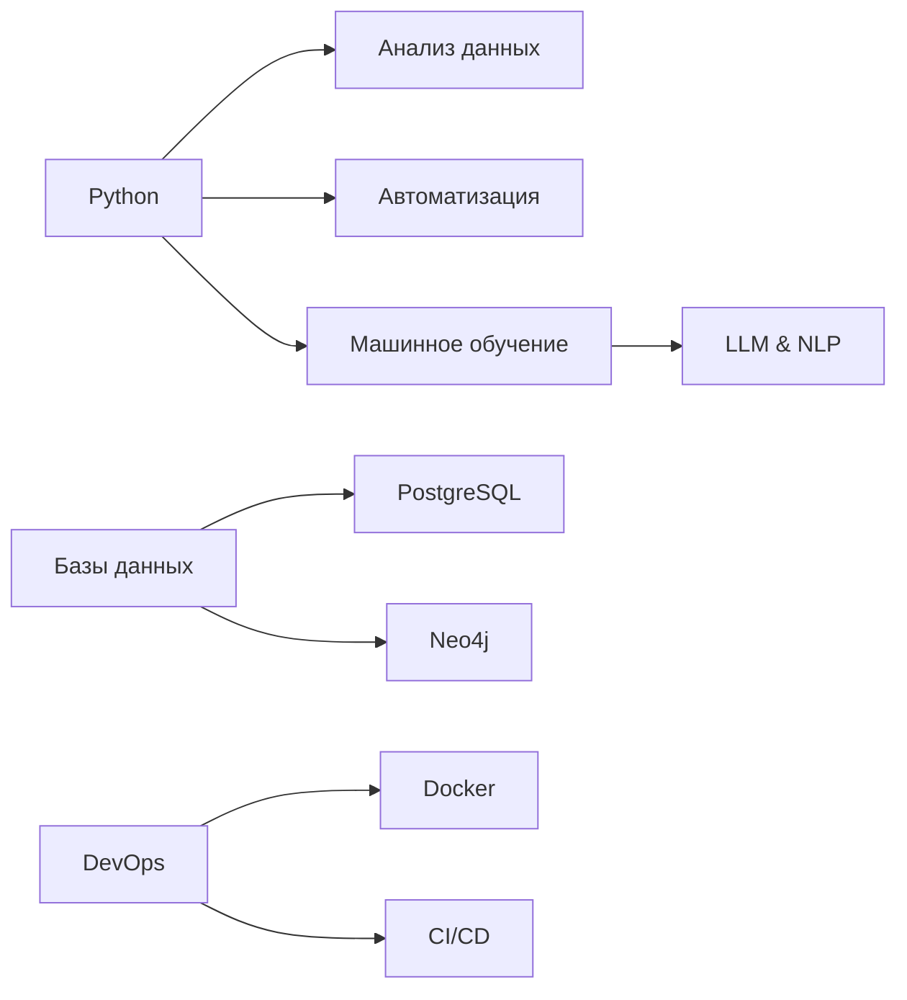

### 👋 Привет! Я Георгий Селиванов

### 🛠️ Технический стек
**Языки:**  
🐍 Python (Pro) | ☕ Java | 📊 SQL | 📱 Dart  

**Технологии:**  
- **ML/Data Science**: PyTorch, Scikit-learn, Pandas, OpenCV  
- **Инфраструктура**: Docker, GitLab CI/CD, Bash  
- **Базы данных**: PostgreSQL, MongoDB, Neo4j  
- **Web**: Selenium, Requests, FastAPI  

### 🚀 Ключевые проекты
| Проект | Технологии | Описание |
|--------|------------|----------|
| [**PDF-to-LaTeX**](https://github.com/Ge-os/to-latex) | Gemini API | Конвертация PDF в LaTeX с ИИ |
| [**TorrentInno**](https://github.com/TorrentInnoOrg/TorrentInno) | Python, KivyMD | Кроссплатформенный Torrent-клиент |
| [**Fluently**](https://github.com/FluentlyOrg/Fluently-fork) | LLM, RAG | Платформа для изучения языков с ИИ |
| [**CookieLess**](https://cookielessorg.github.io/CookieLess) | Pandas, JS | Аналитика без cookies |

### 🎓 Образование
**Университет Иннополис**  
📅 2023-2027 | Компьютерные науки  
- Курсы: ML, Распределенные системы, Оптимизация  

**Школа аналитиков Яндекс**  
🥇 Летний интенсив 2025 | Фуллстек-проект  

### 📬 Контакты

---