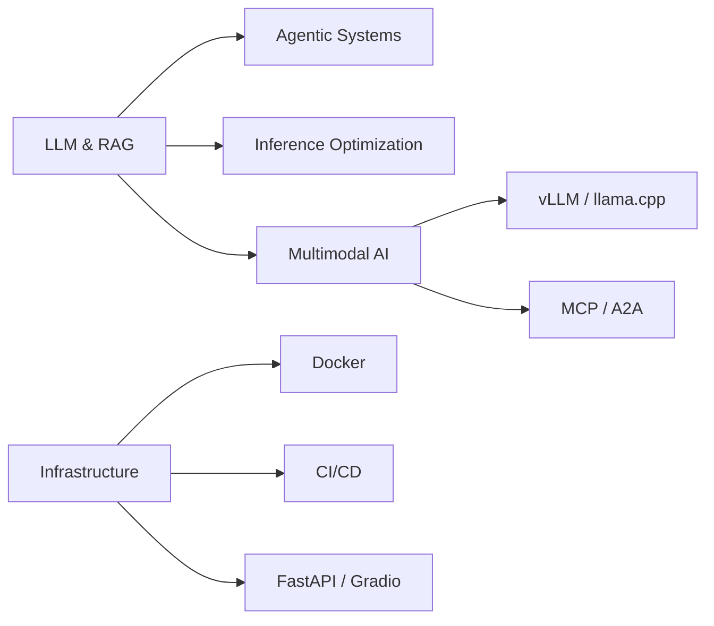

### 👋 Привет! Я Георгий Селиванов

```mermaid
graph LR
    A[LLM & RAG] --> B[Agentic Systems]
    A --> C[Inference Optimization]
    A --> D[Multimodal AI]
    D --> E[vLLM / llama.cpp]
    D --> F[MCP / A2A]
    G[Infrastructure] --> H[Docker]
    G --> I[CI/CD]
    G --> J[FastAPI / Gradio]
```

### Технический стек
**Языки:**  

  
  
  
  
  
  
  
  
  
  
  
  
  

  
  
  
  
  
  
  
  
  
  
  
  
  
  
  
  
  

### Контакты

---
